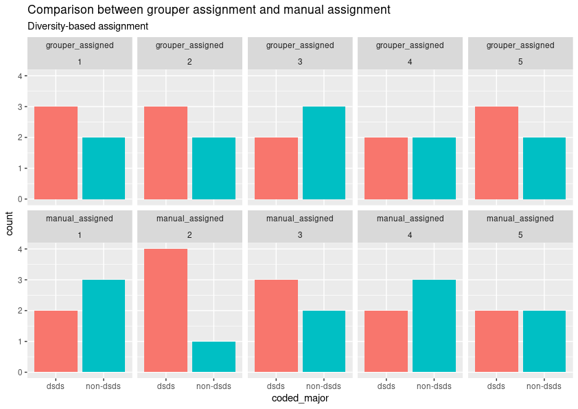
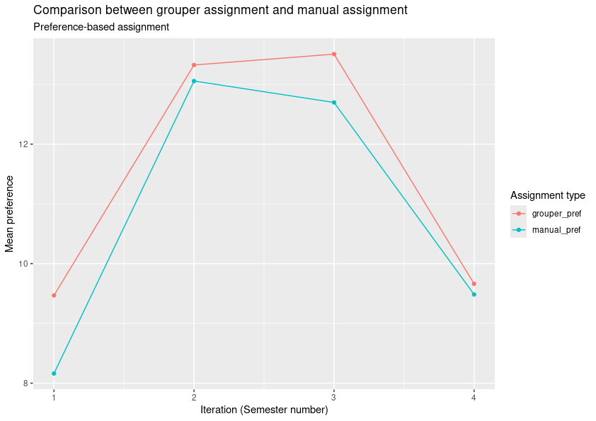

# Summary

A test of citation [@anwar2003student].

# Statement of Need

Institutes of Higher Learning (IHLs) are increasingly using collaborative
learning pedagogies. These pedagogies have the potential to benefit learners in
terms of deeper understanding of course content, as well as teamwork skills
which are highly valued in professional settings. However, the realisation of
these benefits depend on how educators assign learners to groups.

Educators have formulated various mathematical models to perform this
assignment. For instance, @anwar2003student and @meyer2009optassign developed
models that aimed to maximise students' project preferences. Other formulations 
prioritise maximising diversity in backgrounds and balance in skills:
@mcguirk2020assigning described a complex integer linear  programming model to 
assign students to discussion groups, considering not only preferences but also 
group size, and group composition. Yet other models address related but
distinct problems such as assigning students to elective courses
[@berovs2015integer] or incorporating staff workload into student-to-project 
supervisor assignments [@ramotsisi2022optimization].

As part of our research into the problem, in-depth interviews with two faculty
members from from contrasting disciplines were also conducted. 

The first professor interviewed was from the School of Computing at National
University of Singapore. In his course, the professor allowed students to form
form sub-groups, on their own, of up to three members. Sub-groups were then
paired up to create larger project teams of six. The pairing was carried out with 
the objective of neutralizing differences in skill levels across the final teams. 

This is a similar procedure that we utilise in one of the courses in our own
department (Department of Statistics and Data Science). However, instead of
utilising skills, we prioritised the preference of each self-formed group for
their roles and topics. Allowing students to form groups on their own ensures
familiarity within sub-groups, but, by matching sub-groups randomly, students
are possibly forced to collaborate with a group they may not know so well. This
replicates what happens at the workplace.

In the second interview, we approached a faculty member from the Department of
Communications and New Media to gain a better understanding of the practical
challenges in group allocation for courses in the Arts and Social Sciences
field. The professor indicated that, for certain topics/tasks, the main
objective in group allocation is to achieve diversity. According to her, the
ideal group should encompass a range of viewpoints and expertise, drawn from
varied academic specializations and personal backgrounds, e.g. year of study.
She explained that when group members come from diverse backgrounds, they are
able to understand the problem from multiple angles; this generally leads to a
broader range of innovative solutions.

In summary, from our interviews and our literature review, we observe there are
several factors that educators could prioritise when performing group
assignment in higher education. Whichever factor is used, it is apparent that
there is a need for an algorithmic solution to the assignment phase. This would
ease the burden on the instructor, while providing an objective procedure for
the assignment. Our contribution is an R package `grouper` that offers two
flexible group allocation strategies.

# Functionality and Usage

`grouper` provides two distinct optimisation models, both of which are are
formulated as integer linear programs.

The Preference-Based Assignment (PBA) model allows educators to assign student
groups to topics primarily to maximise overall student preferences for those
topics. The topics can be viewed as project titles. The model allows for
repetitions of each project title. It is also possible to allow each project
team to be comprised of multiple sub-groups in this formulation.

To execute the optimisation routine, an instructor needs to prepare:

1.  A group composition table listing the member students within each
    self-formed group.
2.  A preference matrix containing the preference that each self-formed 
    group has for each topic.
3.  A YAML file defining the remaining parameters of the model.

The Diversity-Based Assignment (DBA) model enables educators to assign students
to groups and topics with the dual aims of maximising diversity (based on
student attributes) within groups and balancing specific skill levels across
different groups. These are formulated in a single objective function with
weights assigned to each component.

To execute the DBA optimisation routine, the instructor needs to prepare:

1.  A group composition table containing:
    *   the member students within each self-formed group,
    *   the demographics that will be used to compute pairwise dissimilarity
        between students, and
    *   a numeric measure of each student's skill.
2.  A YAML file defining the remaining parameters of the model.

# Application to Courses

## To Interdisciplinary Course

The final author of this paper teaches an interdisciplinary course together
with a colleague from the English Language department. Students first learn
about data science and linguistics in lectures. Then, in small groups,
they discuss chosen topics from the viewpoint of linguistics and data
science/statistics. As such, it is necessary to create groups with a good
balance of Data Science and Statistics (dsds) majors, and non-dsds majors.

The table below shows a manual breakdown of 24 students in a tutorial class,
into 5 discussion groups. On the left two columns, we see the result of a
manual allocation. On the two right-most columns, we observe the result of
assignment from the DBA model using `grouper`.

|          | manual_assigned |          | grouper_assigned |          |
|----------|-----------------|----------|------------------|----------|
| group_id | dsds            | non-dsds | dsds             | non-dsds |
| 1        | 2               | 3        | 3                | 2        |
| 2        | 4               | 1        | 3                | 2        |
| 3        | 3               | 2        | 2                | 3        |
| 4        | 2               | 3        | 2                | 2        |
| 5        | 2               | 2        | 3                | 2        |

It is clear that the routine does a fairer assignment. Take note that there are
5 such tutorial groupings, so this type of grouping assignment has to be
carried out five times. Here is a visualisation of the groupings:

## To Course with Sub-group Structure

In the "Statement of Need" section, we mentioned a Data Science course that
requires allocating students into project teams with 2 sub-groups. One
sub-group typically develops a user-interface while the other works on the data
analysis. The table below shows how `grouper` could have benefited us, if we
could have used it over the four semesters that we taught the course.

Consider the first semester we ran the course (row 1): the enrolment was 62 and
there were 4 topic titles to be allocated (with some permitted repetitions). In
the manual allocation carried out, the average preference of the self-formed
groups was 7.45.  *If we could have used `grouper`*, the mean preference for
this same group of students would have been 9.53 (higher is better).

| Sem | manual_pref | grouper_pref | class_size | n_topics | n_project_teams |
|-----|-------------|--------------|------------|----------|-----------------|
| 1   | 7.45        | 9.53         | 62         | 4        | 7               |
| 2   | 12.1        | 13.4         | 108        | 7        | 13              |
| 3   | 11.6        | 13.6         | 89         | 7        | 11              |
| 4   | 9.34        | 9.71         | 151        | 5        | 18              |

It is clear that `grouper` would have improved the overall preference if we had
access to it.

# Discussion

While it seems as though the improvement proffered in both applications above
is minimal, the reader should be aware that manual allocation is extremely
arduous. For the data science course involving sub-groups, it typically takes a
week or more to carry out the process manually. With `grouper`, it only takes 2
minutes! Using it will allow the educator time to focus more on course content and
student guidance.

# References
